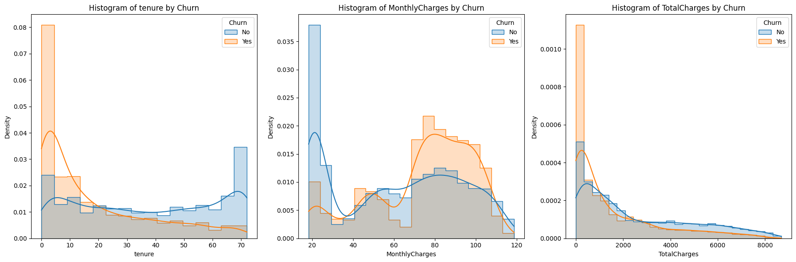

# Laporan Proyek Machine Learning - Syafirna Miftahul Jannah

## Domain Proyek
*Churn* Pelanggan adalah situasi dimana pelanggan berhenti berlangganan produk dari perusahan[1] [2]. Kondisi ini merupakan tantangan bagi perusahaan terutama pada industri yang kompetitif di era teknologi ini seperti perusahaan telekomunikasi. *Churn* pelanggan menyebabkan penurunan pada profit perusahaan karna biaya yang dikeluarkan untuk memperoleh pelanggan baru lebih tinggi dibanding biaya mempertahankan pelanggan yang sudah ada[3]. oleh karna itu memahami faktor-faktor yang mempengaruhi *churn* pelanggan dan mengantisipasi tindakan *churn* sangatlah krusial. Analisis *churn* menjadi alat penting dalam mengidentifikasi pola dan tren yang dapat membantu perusahaan mengambil tindakan preventif.

Urgensi untuk menyelesaikan masalah *churn* pada pelanggan ini dinilai sangat tinggi karena :
1. Menyebabkan kerugian secara finansial yang akan berdampak langsung pada penurunan pendapatan
2. Memahami faktor yang dapat mempengaruhi churn dapat membantu meningkatkan kapuasan pelanggan yang diharapkan dapat mengurangi churn
3. Dalam pasar yang sangat kompetitif, mempertahankan pelanggan yang ada lebih mudah dan lebih murah dibandingkan menarik pelanggan baru dari pesaing.

Penerapan model *machine learning* dalam menganalisis *churn* pelanggan memungkinkan perusahaan untuk memprediksi apakah seorang pelanggan akan *churn* atau tidak, serta mengidentifikasi faktor-faktor utama yang berkontribusi terhadap *churn*. cara *machine learning* dapat membantu adalah :
1. Prediksi *Churn* Pelanggan: Model *machine learning* dapat memprediksi dengan tingkat akurasi yang tinggi apakah seorang pelanggan akan *churn* berdasarkan data historis dan perilaku pelanggan.
2. Identifikasi Faktor-faktor Kunci: Dengan menggunakan algoritma *machine learning*, perusahaan dapat mengidentifikasi faktor-faktor yang paling berpengaruh terhadap *churn* pelanggan, seperti kualitas layanan, harga, fitur yang tersedia, dan interaksi pelanggan dengan layanan pelanggan.
3. Segmentasi Pelanggan: Berdasarkan prediksi dan faktor-faktor kunci yang diidentifikasi, perusahaan dapat melakukan segmentasi pelanggan yang lebih efektif dan menargetkan pelanggan yang berisiko tinggi untuk *churn* dengan kampanye retensi yang disesuaikan.

## Business Understanding
Analisis ini akan menghasilkan manfaat yang significan terhadap bisnis dan ekonomi yaitu:
1. Peningkatan Retensi Pelanggan, perusahan dapat mengambil langkah pencegahan yang tepat seperti menawarkan insentif khusus atau meningkatkan kualitas layanan, ini akan mengurangi *churn* dan meningkatkan loyalitas pelanggan.
2. Penghematan Biaya: Mengurangi *churn* berarti mengurangi biaya akuisisi pelanggan baru. Mempertahankan pelanggan yang sudah ada jauh lebih ekonomis dibandingkan menarik pelanggan baru, yang biasanya membutuhkan investasi besar dalam pemasaran dan promosi.
3. Optimalisasi Strategi Pemasaran: Data dan wawasan yang diperoleh dari analisis *churn* dapat digunakan untuk mengoptimalkan strategi pemasaran, sehingga lebih efisien dan efektif dalam menargetkan pelanggan yang benar-benar membutuhkan perhatian khusus.

*Stakeholder* dan sasaran yang dituju adalah :
1. Manajemen perusahaan. hasil dapat digunakan untuk membantu pengambilan keputusan strategis
2. Tim pemasaran dan layanan pelanggan atau sejenis. hasil dapat digunakan untuk meningkatkan kualitas layanan dan pemasaran yang efektif

### Problem Statements
- Apakah seorang pelanggan akan *churn* atau tidak?
- Faktor-faktor apa yang paling berpengaruh terhadap *churn* pelanggan?

### Goals
- Mengklasifikasikan pelanggan berdasarkan kecenderungan mereka untuk *churn* atau tidak *churn*.
- Mengidentifikasi faktor-faktor yang memiliki korelasi tertinggi dan paling signifikan yang menyebabkan pelanggan *churn*.

### Solution statements
- Pengumpulan dan Pengolahan Data: Data pelanggan akan dikumpulkan dan diproses untuk memastikan kualitas dan relevansi data yang akan digunakan dalam analisis.
- Penerapan Algoritma *Machine Learning*: Algoritma seperti RandomForestClassifier, GradientBoostingClassifier, dan XGBoost akan diterapkan untuk mengklasifikasikan pelanggan berdasarkan risiko *churn*.
- Evaluasi Model: Model akan dievaluasi menggunakan metrik seperti akurasi, precision, recall, F1-score, dan AUC. Algoritma dengan performa terbaik akan dipilih untuk digunakan lebih lanjut.
- Visualisasi dan Interpretasi Hasil: Hasil analisis akan divisualisasikan untuk memudahkan pemahaman tentang faktor-faktor yang paling berpengaruh terhadap *churn*. *Confusion matrix* dan *feature importance* akan digunakan untuk mengidentifikasi dan memvisualisasikan faktor-faktor tersebut.

## Data Understanding
1. *Data Ghaterring*. Dataset diambil dari kaggle menggunakan Kaggel API kemudian diunduh dengan perintah python. Dataset yang digunakan adalah [Kaggle Telco Customer Churn](https://www.kaggle.com/datasets/blastchar/telco-customer-churn).
2. *Data Assessing atau* penilaian pada data dilakukan dengan :
    - Menampilkan info dari dataframe untuk melihat gambaran tetang jumlah *non-null values* dari setiap kolom dalam dataframe. Hal ini membantu dalam memahami struktur data dan identifikasi awal terhadap kolom-kolom yang memiliki *missing values*. 
    - Melihat jumlah *missing value* dilakukan dengan tujuan mengetahui jumlah nilai yang hilang disetiap kolom, sehingga dapat diputuskan untuk menghapus kolom/row sebelum dianalisis lebih lanjut. tidak didapatkan nilai missin value pada data
    - Melihat jumlah *duplicates* dilakukan untuk jumlah data yang duplikat penting untuk memastikan integritas data. Duplikasi yang ditemukan akan dihapus agar tidak mempengaruhi analisis dan model prediksi yang akan dibuat. tidak didapatkan data duplicate.
    - Melihat lebih jelas nilai variabel kategorikal dengan format selain Boolean atau *Yes* dan *No*. proses ini dilakukan untuk mengetahui variasi dalam variabel kategorikal membantu dalam memahami distribusi data serta merencanakan langkah *encoding* yang tepat untuk analisis selanjutnya.
        - Melihat jumlah nilai dan kelas pada kolom gender. ini dilakukan untuk melihat apakah variabel dapat dilakukan encoding atau tidak. terdapat 2 kelas dalam kolom gender jadi dapat dilakuakan encoding.
        - Melihat jumlah nilai dan kelas pada kolom InternetService. pterdapat 3 jenis kelas pada data. jadi dapat dilakuakan encoding.
        - Melihat jumlah nilai dan kelas pada kolom Contract. terdapat 2 jenis kelas pada data. jadi dapat dilakuakan encoding.
        - Melihat jumlah nilai dan kelas pada kolom PaymentMethod. pterdapat 4 jenis kelas pada data. jadi dapat dilakuakan encoding.
3. *Exploratory data analysis*(EDA). 
    - Memvisualisasikan *variabel numeric* dengan *histogramplot* untuk mengetahui sebaran data *variabel numeric*. 
    Gambar 1. Hasil infomrasi dataframe
    
        - Variabel tenure menunjukkan jumlah bulan pelanggan telah berlangganan layanan. Pada histogram Pelanggan yang churn (Yes) cenderung memiliki tenure yang rendah, terutama di bawah 10 bulan. Ini menunjukkan bahwa pelanggan yang baru berlangganan lebih rentan untuk churn dan Pelanggan yang tidak churn (No) memiliki distribusi tenure yang lebih merata dengan puncak yang muncul pada interval yang lebih panjang, menunjukkan bahwa mereka lebih mungkin untuk bertahan lebih lama dengan layanan.
        - Variabel MonthlyCharges menunjukkan biaya bulanan yang dibayarkan oleh pelanggan. Pada histogram Pelanggan yang churn (Yes) memiliki kecenderungan berada pada rentang biaya bulanan yang lebih tinggi, terutama antara 70 hingga 100 dan Pelanggan yang tidak churn (No) memiliki distribusi biaya bulanan yang lebih merata, tetapi terdapat puncak yang signifikan pada biaya bulanan yang rendah sekitar 20 hingga 30.
        - Variabel TotalCharges menunjukkan total biaya yang dibayarkan oleh pelanggan selama berlangganan. Pada histogram  Pelanggan yang churn (Yes) cenderung memiliki TotalCharges yang rendah, yang berkorelasi dengan tenure yang pendek. Pelanggan yang tidak churn (No) memiliki distribusi TotalCharges yang lebih lebar dan merata, menunjukkan bahwa mereka telah berlangganan lebih lama dan membayar total biaya yang lebih tinggi.
    - *variabel categorical* dengan *bar chart* ini digunakan untuk melihat jumlah data dari masing-masing kelas dalam kolum. ini dapat memberikan wawasan tentang preferensi pelanggan terhadap berbagai layanan yang ditawarkan dan menunjukkan area di mana perusahaan dapat fokus untuk meningkatkan penggunaan layanan tambahan guna meningkatkan kepuasan pelanggan dan mengurangi churn.
      
    Gambar 2. Vsisualisasi pelanggan
    
   
    Gambar 3. Visualisasi Layanan
    
   
    Gambar 4. Visualisasi info billing
    

setelah dilakukan visualisasi dapat simpulkan :

   - Gender female dan male memiliki jumlah hampir sama yaitu Male:3555 dan female 3488
   - pelangganggan mayoritas bukan warga senior dengan jumlah ya 1142 dan no 5901
   - pelanggan yang memiliki parter dan tidak cukup seimbang
   - lebih dari 1/2 pelanggan tidak memiliki tanggungan
   - sebagian besar pelanggan menggunakan layanan telepon dengan jumlah lebih dari 6000 dan pelanggan yang tidak menggunakan telepon dibawah 1000
   - Sekitar 1.000 pelanggan tidak menggunakan layanan telepon sama sekali. Lebih dari 2.500 pelanggan menggunakan layanan multiple lines. Sekitar 3.000 pelanggan tidak menggunakan layanan multiple lines meskipun mereka memiliki layanan telepon.
   - 2000 pelanggan menggunakan layanan DSL. Lebih dari 3.000 pelanggan menggunakan layanan fiber optic, menunjukkan preferensi yang kuat untuk layanan internet yang lebih cepat. Sekitar 1.500 pelanggan tidak menggunakan layanan internet sama sekali.
   - 3.000 pelanggan tidak menggunakan layanan keamanan online. 2.000 pelanggan menggunakan layanan keamanan online. Sekitar 1.500 pelanggan tidak memiliki layanan internet, sehingga tidak menggunakan layanan keamanan online.
   - 3.000 pelanggan tidak menggunakan layanan backup online. 2.000 pelanggan menggunakan layanan backup online. Sekitar 1.500 pelanggan tidak memiliki layanan internet, sehingga tidak menggunakan layanan backup online.
   - 3.000 pelanggan tidak menggunakan layanan perlindungan perangkat. Sekitar 2.000 pelanggan menggunakan layanan perlindungan perangkat. Sekitar 1.500 pelanggan tidak memiliki layanan internet, sehingga tidak menggunakan layanan perlindungan perangkat.
   - Lebih dari 3.000 pelanggan tidak menggunakan layanan dukungan teknis. ekitar 2.000 pelanggan menggunakan layanan dukungan teknis. Sekitar 1.500 pelanggan tidak memiliki layanan internet, sehingga tidak menggunakan layanan dukungan teknis.
   - 2.500 pelanggan tidak menggunakan layanan streaming TV. Sekitar 2.500 pelanggan menggunakan layanan streaming TV. Sekitar 1.500 pelanggan tidak memiliki layanan internet, sehingga tidak menggunakan layanan streaming TV.
   - Sekitar 2.500 pelanggan tidak menggunakan layanan streaming film. Sekitar 2.500 pelanggan menggunakan layanan streaming film. Sekitar 1.500 pelanggan tidak memiliki layanan internet, sehingga tidak menggunakan layanan streaming film.
   - lebih dari 3000 pelanggan dengan kontrak bulan ke bulan. kurang dari 1500 pelanggan dengan kontak 1 tahun dan lebih dari 1500 pelanggan dengan kontrak 2 tahun
   - mayoritas pelanggan memilih tagihan tanpa kertas lebih dari 4000. sedangkan kurang dari 3000 pelanggan memilih tagihan dengan kertas.
   - metode pilihan pelanggan untuk pembayaran adalah Electronic check dengan jumlah 2365. dan masing-masing metode lain yaitu Maile check, Bank transfer, Credit card dengan total lebih dari 1500.
   - korelasi *variabel numeric* dengan *Heatmap* untuk melihat fitur yang paling mempengaruhi *churn* pelanggan.
  
Gambar 5. Heatmap

   
setelah dilakukan visualisasi dapat disimpulkan :

- pada variabel tenure Korelasi negatif dengan churn (-0.35) menunjukkan bahwa meningkatkan durasi berlangganan pelanggan dapat mengurangi churn. Program loyalitas atau insentif untuk memperpanjang durasi berlangganan dapat efektif.
- variabel MonthlyCharges Korelasi positif lemah dengan churn (0.19) menunjukkan bahwa biaya bulanan yang lebih tinggi mungkin sedikit meningkatkan risiko churn, tetapi tidak signifikan. Menawarkan paket harga yang sesuai dengan nilai yang diberikan dapat membantu mengurangi churn.
- dan variabel TotalCharge orelasi negatif lemah dengan churn (-0.20) menunjukkan bahwa pelanggan yang telah membayar lebih banyak secara keseluruhan cenderung lebih setia. Fokus pada pelanggan yang telah menunjukkan komitmen finansial bisa menjadi strategi untuk retensi.

### Variabel-variabel pada Kaggle Telco Customer Churn dataset adalah sebagai berikut:
Dataset "*Telco Customer Churn*" dari Kaggle berisi data pelanggan dari perusahaan telekomunikasi, yang mencakup berbagai informasi demografis, penggunaan layanan, dan rincian penagihan. Data ini digunakan untuk menganalisis dan memprediksi apakah seorang pelanggan akan berhenti berlangganan (churn) atau tidak.

1. Jumlah Data
    - Jumlah Baris (Observasi): 7,043
    - Jumlah Kolom (Fitur): 21
2. Kondisi Data
    - Kehilangan Data: Data ini mungkin memiliki nilai yang hilang atau kosong. Penting untuk memeriksa dan menangani missing values sebelum melakukan analisis lebih lanjut.
    - Duplikasi Data: Perlu memeriksa adanya data duplikat yang dapat mempengaruhi analisis.
    - Jenis Data: Dataset ini berisi data numerik dan kategorikal.
3. Informasi Mengenai Data yang Digunakan
    - *customerID*: String unik untuk mengidentifikasi setiap pelanggan.
    - *gender*: Kategorikal; Jenis kelamin pelanggan (Male, Female).
    - *SeniorCitizen*: Numerik; Indikator apakah pelanggan adalah warga senior (1 = Yes, 0 = No).
    - *Partner*: Kategorikal; Apakah pelanggan memiliki pasangan (Yes, No).
    - *Dependents*: Kategorikal; Apakah pelanggan memiliki tanggungan (Yes, No).
    - *tenure*: Numerik; Lama pelanggan telah berlangganan dalam bulan.
    - *PhoneService*: Kategorikal; Apakah pelanggan memiliki layanan telepon (Yes, No).
    - *MultipleLines*: Kategorikal; Apakah pelanggan memiliki beberapa jalur telepon (No phone service, No, Yes).
    - *InternetService*: Kategorikal; Jenis layanan internet pelanggan (DSL, Fiber optic, No).
    - *OnlineSecurity*: Kategorikal; Apakah pelanggan memiliki layanan keamanan online (No internet service, No, Yes).
    - *OnlineBackup*: Kategorikal; Apakah pelanggan memiliki layanan backup online (No internet service, No, Yes).
    - *DeviceProtection*: Kategorikal; Apakah pelanggan memiliki layanan perlindungan perangkat (No internet service, No, Yes).
    - *TechSupport*: Kategorikal; Apakah pelanggan memiliki layanan dukungan teknis (No internet service, No, Yes).
    - *StreamingTV*: Kategorikal; Apakah pelanggan memiliki layanan streaming TV (No internet service, No, Yes).
    - *StreamingMovies*: Kategorikal; Apakah pelanggan memiliki layanan streaming film (No internet service, No, Yes).
    - *Contract*: Kategorikal; Jenis kontrak pelanggan (Month-to-month, One year, Two year).
    - PaperlessBilling: Kategorikal; Apakah pelanggan menggunakan penagihan tanpa kertas (Yes, No).
    - *PaymentMethod*: Kategorikal; Metode pembayaran pelanggan (Electronic check, Mailed check, Bank transfer (automatic), Credit card (automatic)).
    - *MonthlyCharges*: Numerik; Jumlah yang ditagihkan kepada pelanggan setiap bulan.
    - *TotalCharges*: Kategorikal; Total jumlah yang ditagihkan kepada pelanggan.
    - *Churn*: Kategorikal; Apakah pelanggan berhenti berlangganan (Yes, No).

## Data Preparation
Proses yang dilakukan adalah pembersihan data :
1. Pengecekan *Missing value*.
    - *Missing value* adalah nilai yang hilang atau kosong dalam dataset
    - Kegunaannya adalah untuk memastikan bahwa analisis dan model yang dibangun tidak dipengaruhi oleh data yang tidak lengkap.
    - Teknik yang dilakukan adalah dengan melihat jumlah *missing* value dengan *method* isna().sum()
    - Setelah dilakukan pengecekan tidak ditemukan *missing value* pada data
2. Pengecekan Data *Duplicate*
    - Data duplikat adalah baris data yang identik yang muncul lebih dari sekali dalam dataset.
    - Kegunaannya adalah Memastikan bahwa analisis dan model yang dibangun tidak bias akibat duplikasi data.
    - Teknik yang dilakukan Menggunakan metode duplicated().sum() untuk menghitung jumlah baris duplikat dalam dataset.
    - Tidak ditemukan data duplicate pada data
3. Perbaikan Format tipe data
    - Perbaikan format tipe data: Memastikan bahwa tipe data setiap variabel sesuai dengan isinya.
    - Kolom TotalCharges: Mengubah tipe data dari *object* menjadi numerik.
    - teknik yang dilakukan menggunakan pandas to_numeris
4. Menghapus colom yang tidak diperlukan 
    - Kolom customerID dihapus karena tidak memiliki pengaruh terhadap prediksi churn.
5. Memastikan Nilai Minimum TotalCharges
    - Pemeriksaan nilai TotalCharges:
        Memastikan bahwa nilai TotalCharges yang bernilai 0 benar-benar sesuai dengan tenure yang bernilai 0 bulan dan Mengoreksi nilai TotalCharges yang tidak sesuai dengan menghitung ulang berdasarkan biaya bulanan (MonthlyCharges) dan tenure.
6. *Feature Encoding*
    - *Feature encoding* adalah proses mengubah data kategorikal menjadi format numerik yang dapat digunakan oleh algoritma machine learning.
    - Kegunaannya Memastikan bahwa data kategorikal dapat diproses oleh model machine learning.
    - Teknik yang dilakukan adalah One-Hot Encoding: Mengubah data kategorikal menjadi variabel dummy (0 dan 1).
    - *Label Encoding*: Mengubah data kategorikal menjadi angka.
7. Menentukan Variabel Target dan Variabel Pemengaruh
    - Variabel Target: Variabel yang ingin diprediksi adalah Churn, yaitu apakah pelanggan akan berhenti berlangganan (Yes/No).
    - Variabel Pemengaruh: Variabel-variabel lain dalam dataset yang dapat mempengaruhi Churn, seperti tenure (lama berlangganan), MonthlyCharges (biaya bulanan), jenis layanan, kontrak, dan sebagainya.
8. Membagi Data dengan train_test_split
Data akan dibagi menjadi data latih (train) dan data uji (test) dengan perbandingan 90:10 menggunakan train_test_split, serta menggunakan random_state=123 untuk memastikan hasil pembagian yang konsisten.

## Modeling
1. Model yang Dibandingkan
    - *Random Forest*
        - Deskripsi: *Random Forest* adalah ensemble model yang terdiri dari banyak pohon keputusan.
        - Kelebihan: Stabil dan cenderung akurat dalam berbagai situasi, Dapat menangani *overfitting* dengan baik dan Tidak terlalu sensitif terhadap penyesuaian *hyperparameter*.
        - Kekurangan: Memerlukan sumber daya yang cukup besar dan waktu training lebih lama dibandingkan dengan model lain.
        - Cara kerjanya pada dataset : Algoritma akan membangun beberapa pohon keputusan menggunakan subset acak dari data pelanggan dan fitur. Setiap pohon akan memberikan prediksi churn atau tidak churn, dan hasil akhir akan diambil berdasarkan mayoritas prediksi dari pohon-pohon tersebut.
        - Parameter yang Digunakan: n_estimators=100 (jumlah pohon dalam hutan), random_state=42 (untuk memastikan hasil yang konsisten).
    - *XGBoost (Extreme Gradient Boosting)*
        - Deskripsi: XGBoost adalah algoritma *gradient boosting* yang efisien dan cepat.
        - Kelebihan: Kinerja yang kuat dan efisiensi tinggi, Mampu menangani *overfitting* dengan baik dan Memiliki regulasi untuk mengontrol kompleksitas model.
        - Kekurangan: Perlu penyesuaian *hyperparameter* yang cermat untuk mendapatkan hasil optimal.
        - Cara Kerja pada dataset : XGBoost akan membangun model berturut-turut, di mana setiap model baru mencoba untuk mengoreksi kesalahan dari model sebelumnya. Ini dilakukan dengan menambahkan bobot lebih pada data yang sulit diprediksi.
        - Parameter yang Digunakan: n_estimators=1000 (jumlah boosting rounds), learning_rate=0.01 (kecepatan pembelajaran), random_state=42 (untuk hasil yang konsisten).
    - *Gradient Boosting Machines*(GBM)
        - Deskripsi: GBM adalah metode ensemble yang membangun model secara bertahap dengan memperbaiki kelemahan model sebelumnya.
        - Kelebihan: Cenderung memberikan hasil prediksi yang akurat, Fleksibel dan dapat menangani berbagai macam masalah, Memiliki mekanisme untuk mengurangi overfitting.
        - Kekurangan:Memerlukan penyesuaian hyperparameter yang lebih cermat dibandingkan dengan Random Forest, Proses training mungkin memerlukan waktu yang lebih lama daripada model lainnya.
        - cara kerja pada dataset : GBM membangun model secara bertahap, setiap model baru berusaha untuk memperbaiki kesalahan dari model sebelumnya dengan menambahkan bobot lebih pada data yang salah prediksi.
        - Parameter yang Digunakan: n_estimators=1000 (jumlah boosting stages), learning_rate=0.01 (kecepatan pembelajaran), random_state=42 (untuk hasil yang konsisten).
2. Tahapan Pemodelan
    - Setelah menyelesaikan persiapan data yang siap untuk dilatih dengan algoritma *machine learning* maka dilakukan Inisialisasi Model: Menyusun dictionary untuk menyimpan model-model yang akan dibandingkan.
    - Mengatur *hyperparameter* dari model yang akan dilatih
    - *Training* Model: Melatih setiap model menggunakan data *training* (X_train, y_train).
    - Penyesuaikan *hyperparameter* untuk menemukan hasil akurasi terbaik. langkah ini dilakukan dengan menambah atau mengurangi nilai *learning_rate* seperti 0.1 menjadi 0.2 atau 0.01 dan menambah atau mengurangi n_estimator dengan kisaran 100, 1000, 2000 hingga mendapatkan hasil seperti yang dijelaskan dalam tahap evaluasi.
3. Model Terbaik: *Gradient Boosting Machines*(GBM)
Berdasarkan hasil pelatihan dan evaluasi, model terbaik untuk menangani masalah klasifikasi Churn pada dataset ini adalah *Gradient Boosting Machines*(GBM). GBM telah menunjukkan hasil akurasi yang lebih baik dari dua algoritma lainnya dan evaluasi lainnya yang juga unggul.

## Evaluation
1. Tabel Evaluasi Model

Tabel 1. Hasil Evaluasi 

| Model              | Accuracy | F1-score | Precision | Recall  |
|--------------------|----------|----------|-----------|---------|
| Gradient Boosting  | 0.818    | 0.810    | 0.812     | 0.818   |
| Random Forest      | 0.793    | 0.782    | 0.783     | 0.793   |
| XG Boost           | 0.809    | 0.800    | 0.801     | 0.809   |

2. Interpretasi Hasil Metrik
    - Akurasi: Menunjukkan seberapa sering model melakukan prediksi yang benar secara keseluruhan. Model *Gradient Boosting* memiliki akurasi tertinggi yaitu 81.8%, diikuti oleh *XGBoost* dengan 80.9%, dan *Random Forest* dengan 79.3%.
    - Precision: Mengukur akurasi dari prediksi positif dari total prediksi positif. Model *Gradient Boosting* memiliki precision sebesar 81.2%, yang berarti dari semua prediksi bahwa pelanggan akan *churn*, sekitar 81.2% benar-benar *churn*. *XGBoost* dan *Random Forest* memiliki *precision* yang hampir sama, yaitu sekitar 80.1% dan 78.3% masing-masing.
    - *Recall*: Menunjukkan seberapa banyak dari kelas positif yang diprediksi dengan benar oleh model. Model *Gradient Boosting* memiliki recall tertinggi yaitu 81.8%, yang berarti model ini mampu mendeteksi 81.8% dari semua pelanggan yang sebenarnya *churn*. *XGBoost* dan *Random Forest* memiliki recall yang lebih rendah, yaitu 80.9% dan 79.3% masing-masing.
    - *F1-score*: Merupakan *harmonic mean* dari *precision* dan *recall*, yang memberikan keseimbangan antara kedua metrik tersebut. Model *Gradient Boosting* memiliki F1-score tertinggi yaitu 81.0%, mengindikasikan keseimbangan yang baik antara precision dan recall. XGBoost memiliki F1-score 80.0%, sedangkan *Random Forest* memiliki F1-score 78.2%.
3. Analisis Hasil
Berdasarkan tabel evaluasi di atas, dapat dilihat bahwa model *Gradient Boosting Machine*(GBM) memberikan performa terbaik dalam memprediksi churn pelanggan, dengan nilai akurasi, precision, recall, dan F1-score yang lebih tinggi dibandingkan dengan *Random Forest dan XGBoost*. Hasil ini konsisten dengan analisis sebelumnya yang menunjukkan bahwa GBM adalah model terbaik untuk menangani dataset ini.
4. Kesimpulan
    - Keberhasilan Proyek: Proyek ini dapat dianggap berhasil karena model GBM mampu mencapai akurasi sebesar 81.8%, dengan nilai F1-score, precision, dan recall yang juga tinggi. Ini menunjukkan bahwa model mampu memprediksi churn pelanggan dengan cukup baik.
    - Pencapaian Goals: Goals proyek yang mencakup membangun model untuk mengklasifikasikan pelanggan berdasarkan kecenderungan churn dan mengidentifikasi faktor yang mempengaruhi churn telah tercapai dengan baik. Model GBM telah berhasil dalam mencapai goals ini.
    - Penyelesaian Problem: Model GBM telah memberikan hasil yang signifikan dalam menyelesaikan masalah klasifikasi churn pelanggan. Dengan menggunakan metrik yang relevan seperti akurasi, precision, recall, dan F1-score, evaluasi model ini memberikan pemahaman yang lebih dalam tentang kinerja dan efektivitas model dalam konteks dataset dan problem statement yang ada.
    - Dengan demikian, model Gradient Boosting Machine (GBM) direkomendasikan untuk diterapkan dalam aplikasi praktis untuk meningkatkan retensi pelanggan berdasarkan prediksi churn.

# Reference
[1] Rahayu, S., & Faulina, S. T. (2022). Pengaruh Digital Customer Experience dalam Menciptakan Customer Satisfaction dan Customer Loyalty di Era Digital. Jesya (Jurnal Ekonomi Dan Ekonomi Syariah), 5(1), 1-13.

[2] Jumawar, E., & Nurmartian, E. (2021). Pengaruh Customer Experience dan Customer Value terhadap Customer Loyalty Indihome (Pada Pelanggan Indihome Area Gegerkalong). Journal Competency of Business, 5(02), 102-111.

[3] RM, G. (2020). Prediction of customer plan using churn analysis for telecom industry. Recent Advances in Computer Science and Communications (Formerly: Recent Patents on Computer Science), 13(5), 926-929.
